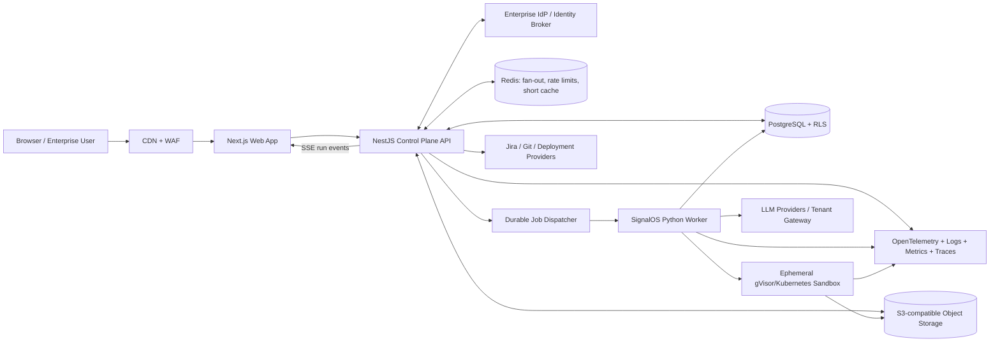

# SignalOS Enterprise SaaS Full-SDLC Implementation Plan

Status: proposed implementation baseline  
Prepared: 2026-07-11  
Scope: convert Foundry/SignalOS Desktop into an enterprise-ready, logically multi-tenant SaaS and adopt the ClearReq backend as the requirements and planning foundation for the complete software-development lifecycle.

## 1. Executive decision

Build the SaaS as two cooperating planes rather than rewriting either product:

1. **ClearReq becomes the SaaS control plane and requirements system of record.** Reuse its NestJS API, Next.js shell, PostgreSQL event ledger, requirement intake/decomposition, human gates, planning, artifact lineage, RBAC, encryption, source registry, provider interfaces/evaluations, outbox patterns, Jira integration, replay/diff, and evaluation assets. Adapt provider routing to tenant-scoped vault credentials before shared use.
2. **SignalOS becomes the governed execution plane.** Keep the Python gate engine, AgentLoop, provider adapter, stack adapters, scaffolding, code generation, test-first build, validation, security, proof, and closeout logic. Run it only inside tenant-scoped ephemeral workers.
3. **PostgreSQL becomes authoritative for SaaS identity, tenancy, workflow state, approvals, usage, and audit.** A worker-local `.signalos/` tree remains a compatibility projection during migration, not the SaaS source of truth.
4. **Object storage becomes authoritative for uploaded source material, workspace snapshots, generated artifacts, logs, exports, and proof bundles.**
5. **The web client uses HTTP for commands and Server-Sent Events (SSE) for resumable run output.** Tauri IPC remains supported only by the desktop client during transition.
6. **Tenancy is logical, not one deployment per customer.** All shared tables, object keys, cache entries, events, jobs, secrets, and usage records are tenant-scoped. PostgreSQL row-level security (RLS) provides the database enforcement floor.

This is an adoption and convergence program, not a copy-paste rewrite. ClearReq code may be reused because it is owned by the same owner, but it should retain history and tests through a subtree or service-level integration.

## 2. Product outcome

The resulting SaaS must let an enterprise team take a change from an unclear request to a traceable production-ready release:

```text
Intake
  -> evidence extraction
  -> requirement decomposition
  -> open-question resolution
  -> requirement approval
  -> acceptance/test intent
  -> prioritization and planning
  -> architecture and design approval
  -> governed code generation
  -> build, test, security and UX proof
  -> release approval
  -> deployment/handoff
  -> runtime feedback, drift and next change
```

Every delivered code file and verification result must trace back to approved requirements. Every requirement change must identify affected design, code, tests, risks, release evidence, and deployed versions.

## 3. Scope boundaries

### 3.1 Included

- Browser-based enterprise application.
- Logical multi-tenancy with organizations, projects, memberships, roles, and project-scoped access.
- OIDC/SAML SSO and optional SCIM provisioning.
- ClearReq requirement intake, decomposition, story gates, QA gates, prioritization, planning, artifact analysis, lineage, and optional Jira synchronization.
- SignalOS G0-G5 governance and agentic product generation.
- Durable, resumable, cancellable human-in-the-loop workflows.
- Ephemeral sandbox execution for generated code, dependency installation, tests, previews, security checks, and proof.
- Tenant-scoped provider connections and encrypted secrets.
- Append-only product ledger, security audit, usage ledger, exports, retention, and erasure workflows.
- Observability, backup/restore, disaster recovery, rate limits, quotas, support tooling, and enterprise release gates.
- Transitional desktop support against the same APIs.

### 3.2 Explicitly excluded from the first enterprise release

- A dedicated physical deployment for every tenant. Dedicated deployments may be a premium option later.
- Unrestricted Docker-in-Docker or access to the host Docker socket.
- Arbitrary outbound network access from build sandboxes.
- Silent autonomous production deployment. Live deployment remains policy- and approval-gated.
- Rewriting mature ClearReq requirements logic in Python.
- Rewriting mature SignalOS execution logic in TypeScript.
- Supporting every current stack adapter in the first hosted pilot. The first hosted set should be React/Vite, Node API, and Python/FastAPI; add stacks behind sandbox conformance tests.

## 4. Evidence-based current-state assessment

### 4.1 SignalOS/Foundry assets to preserve

The current repository contains approximately:

- 79 non-test frontend TypeScript/TSX/JavaScript files.
- 11 Rust source files in the Tauri host.
- 199 non-bundled Python library files.
- 196 Python test files (2,763 tests currently collected) and 68 intended root frontend test files.

Valuable reusable boundaries already exist:

- `src/js/ipc.js` centralizes Tauri commands and event correlation. This is the web transport replacement seam.
- `python/signalos_ipc_server.py` centralizes the command protocol, agent entry points, cancellation, resume, project routing, and event envelopes.
- `python/signalos_lib/product/gate_orchestrator.py` owns the governed G0-G5 state machine and persists `delivery.json`.
- `python/signalos_lib/product/agent_loop.py` owns governed tool dispatch, test-first enforcement, path containment, command allowlists, run ledgers, cancellation checks, and provider interaction.
- `python/signalos_lib/product/subagent_build.py` owns plan-driven G4 task implementation, test gates, repair, independent review, and build evidence.
- `python/signalos_lib/product/stacks.py` and `validation.py` provide stack-specific scaffolding and validation.
- `delivery.py`, `generation.py`, `proof.py`, `security_gate.py`, and `closeout.py` provide the broader delivery bridge and evidence production.
- The frontend already renders agent events, gates, diffs, previews, progress, workspace state, cost, enforcement, and closeout concepts.

Current desktop assumptions that cannot remain in the SaaS API process:

- A mutable process-wide current working directory determines the active workspace.
- Workspace files and most governance state are local filesystem files.
- Active deliveries are cached in process memory in `_ACTIVE_DELIVERIES`.
- The sidecar communicates using newline-delimited JSON over stdin/stdout.
- Tauri owns keychain access, local filesystem access, preview processes, runtime processes, native menus, updates, and workspace watching.
- Python generation and validation execute subprocesses directly against the local workspace.
- Product secrets can be read from workspace `.env*` files and temporarily overlaid into process-global `os.environ`.

These are acceptable inside one isolated worker, but unsafe inside a shared web/API process.

Specific backend wiring gaps found in the current hosted seam are more concrete than a UI problem:

- IPC requests can change process-global `cwd`; callers can provide `cwd`, `project_id`, and `run_id`, while local state paths are derived from those values. The desktop trust boundary does not prove tenant/project/run ownership.
- Active deliveries and cancellation are process-global maps keyed by run ID, and verdict lookup is run-ID based. Concurrent hosted runs need `(tenant, project, run, attempt)` identity and authenticated actor/gate-version checks.
- User-visible events are written to stdout, not durably persisted before publication; refresh/restart/replay therefore cannot be guaranteed by the current IPC stream.
- Progress correlation and provider secrets mutate process environment; provider/model caches are not keyed by tenant credential version, so shared concurrency risks cross-run contamination.
- Provider transcripts, delivery state, gate state, conversations, tool ledgers, and checkpoints are cwd-relative files. Some persistence failures are tolerated, which is unsuitable for an authoritative distributed workflow.
- The production delivery path still uses an in-memory task store even though a PostgreSQL task-store implementation exists; it is not the same durable control-plane dispatch path proposed here.
- CLI `run_delivery` and interactive `GateOrchestrator` are separate orchestration paths. They must become adapters to one canonical `BuildExecutionContract` or backend-direct tests and UI runs can produce different semantics.
- The container runner is promising but strict isolation is not the only/default path, host fallback remains possible, and subprocess paths in build, proof, executor, validation, and preview code can bypass it. Hosted execution must route every user-controlled command through one fail-closed sandbox interface.
- The default Vitest configuration does not constrain discovery, so it currently collects hidden `.claude/worktrees/**` copies and generated `.signalos/**` projects. The observed run collected 206 files instead of the intended 68 root files and exceeded five minutes; CI must scope root tests explicitly and test generated workspaces in a separate suite.

### 4.2 ClearReq assets to adopt

ClearReq is a pnpm monorepo with a NestJS API, Next.js frontend, shared contracts, PostgreSQL, MinIO integration, worker process, evaluations, and 30 migrations. Its API currently contains approximately 227 source files and 70 test files.

ClearReq already provides:

- Tenant and platform tables, membership, role grants, sessions, invitations, platform administration, and break-glass records.
- A deny-by-default capability/role model.
- Requirement ingestion for text and documents.
- Requirement sentences, groups, stories, dependencies, test cases, gates, prioritization, sprint planning, branches, architecture, deliverables, Jira sync, and tracking.
- An append-only product event ledger with optimistic sequence checks, idempotency keys, correlation/causation identifiers, and schema-validated event payloads.
- Replay and diff of covered projections.
- A Postgres-leased outbox pattern using `FOR UPDATE SKIP LOCKED`, retries, exponential backoff, leases, and dead-letter behavior.
- Tenant DEKs wrapped by a master KEK for secret encryption and key rotation.
- Source registry, source licensing metadata, methodology runs, agent roles/runs, evidence validators, governed artifacts, revisions, artifact links, impact marking, and selective rerun foundations.
- A web workbench for intake, decomposition, story gate, QA gate, plan, assignment, sync, tracking, artifacts, exports, tenant administration, platform administration, English, and Arabic.
- Golden evaluation cases for short, messy, Arabic, contradictory, and adversarial requirements.

ClearReq is not yet the final SaaS platform as-is:

- Its production runbook uses one deployment per tenant.
- No PostgreSQL RLS policies were found in the current migrations; tenant isolation depends primarily on application filters and deployment isolation.
- Several projection tables derive tenant through project joins rather than carrying a direct `tenant_id`.
- The worker uses process timers and a singleton/default tenant context in some flows.
- The current production-readiness document lists live-flow blockers and explicitly distinguishes compilation from production readiness.
- Atlassian OAuth is integrated, but general enterprise SAML/OIDC and SCIM still need a product-level identity broker.
- Its worker handles reconciliation and Jira outbox work, not arbitrary long-running code builds.
- Its Docker sandbox/deployment model is not a hostile-code execution boundary.
- Project-scoped roles are currently aggregated in a way that can let a grant on one project influence another, while `/auth/me` does not yet return authoritative project access; project capabilities must be resolved for the requested project.
- Ledger stream uniqueness/lookups are not tenant-qualified, and projection writes plus event appends are not consistently one atomic transaction.
- The provider service/adapters currently resolve process-environment credentials rather than tenant-scoped vault records; the encrypted secret vault is not yet wired to model routing.
- Existing analysis `agent_runs` do not model durable build leases, checkpoints, cancellation, steps, resumable events, or artifacts and must not be overloaded as code-build jobs.
- Replay uses shared/global working structures that need tenant-qualified concurrent replay before it can serve shared SaaS validation.

Therefore, adopt ClearReq's domain and control-plane code while changing its tenancy, workflow, identity, and execution assumptions.

## 5. Target architecture



### 5.1 Control plane responsibilities

The adopted ClearReq NestJS service owns:

- Authentication, sessions, organizations/tenants, membership, RBAC, project access, and platform administration.
- Requirement and evidence lifecycle.
- Full-SDLC workflow state and human decisions.
- Project, run, gate, job, usage, and audit metadata.
- REST/OpenAPI contracts and SSE event subscriptions.
- Idempotency, quotas, billing signals, external integrations, and support tooling.
- Durable dispatch and worker leases.
- Presigned upload/download URLs and workspace snapshot metadata.

The control plane must never run generated code or invoke package managers.

### 5.2 Execution plane responsibilities

The SignalOS Python worker owns:

- Materializing a specific immutable workspace snapshot into a fresh run directory.
- Running a specific requested stage with an explicit tenant, project, run, gate, model policy, and credential lease.
- G0-G5 artifact generation, G4 code generation, validation, security, proof, and closeout.
- Tool and subprocess enforcement inside the worker/sandbox boundary.
- Emitting structured events and artifacts to the control plane.
- Uploading the resulting snapshot/diff/proof and then destroying the local run directory.

The execution worker must not infer tenant or project from process-global state or `cwd`.

### 5.3 Sandbox plane responsibilities

Each build/test/preview job runs as an isolated, non-root workload with:

- A new filesystem and workspace volume per run attempt.
- CPU, memory, process, disk, wall-clock, and output limits.
- Seccomp/AppArmor or gVisor isolation.
- No host mounts, cloud metadata access, container socket, or control-plane credentials.
- Default-deny egress with explicit package-registry and approved integration policies.
- Short-lived scoped credentials delivered only to the job that needs them.
- Dependency caching outside the writable workspace and keyed by tenant-safe content hashes.
- Automatic TTL termination and cleanup.

## 6. Canonical full-SDLC lifecycle

### 6.1 Lifecycle stages

| Stage | Domain owner | Primary output | Human gate | Downstream consumer |
| --- | --- | --- | --- | --- |
| Organization onboarding | ClearReq control plane | tenant, members, policy, provider connection | Admin | all stages |
| Project creation/import | ClearReq control plane | project and initial workspace snapshot | Admin/PO | intake |
| Intake and evidence extraction | ClearReq | intent, source refs, sentences | PO confirms source | decomposition |
| Decomposition | ClearReq | groups, stories, open questions, acceptance intent | Story gate | QA intent and plan |
| Question resolution/change branch | ClearReq | amended requirement revisions | PO | impact traversal |
| QA intent | ClearReq | test cases/Gherkin and coverage links | Tech Manager QA gate | plan and G4 tests |
| Prioritization/plan | ClearReq | ranked stories, dependencies, sprint/release allocation | PO plan confirmation | SignalOS plan adapter |
| Architecture/methodology | ClearReq + SignalOS G1-G3 | architecture, risks, NFRs, design artifacts | Tech Manager/PO | G4 build packet |
| Governed build | SignalOS G4 | source diff, tests, build evidence | build verification + approver | validation |
| Validation/security/proof | SignalOS | build/test/security/UX/runtime evidence | policy-driven | release gate |
| Release/closeout | SignalOS G5 + ClearReq ledger | release candidate, closeout, trace report | release approver | deploy/handoff |
| Deploy/track | integration services | deployment record, telemetry links, drift | environment policy | change intake |

### 6.2 New-feature workflow

Every new feature, not only the initial product, enters through ClearReq:

1. Create a requirement change/branch linked to the current project baseline.
2. Ingest the request and supporting evidence.
3. Decompose it into changed/new stories, acceptance criteria, test intent, NFR/security implications, and open questions.
4. Compute impact through `artifact_links` and mark affected nodes stale or needing review.
5. Obtain story and QA approval.
6. Create or update the canonical plan tasks consumed by SignalOS G4.
7. Materialize the last approved workspace snapshot.
8. Run SignalOS against only the approved change scope plus required integration context.
9. Verify the full suite and traceability, not merely the changed tests.
10. Persist the resulting snapshot and release evidence as a new immutable baseline.

### 6.3 Canonical trace graph

Extend ClearReq's generic artifact link fabric so the following chain is queryable in both directions:

```text
source document / sentence
  -> requirement / story
  -> acceptance criterion
  -> planned task
  -> architecture/design decision
  -> code commit / workspace snapshot / file
  -> test case / test execution
  -> security or quality finding
  -> build artifact / release candidate
  -> deployment
  -> incident / feedback / next requirement branch
```

Add node kinds:

- `plan_task`, `design_decision`, `workspace_snapshot`, `code_commit`, `file`, `test_execution`, `finding`, `release_candidate`, `deployment`, `incident`.

Add link types:

- `satisfies`, `implements`, `tests`, `verifies`, `derived-from`, `changed-by`, `blocks`, `mitigates`, `packaged-in`, `deployed-as`, `regressed-by`, `supersedes`.

Governance/security/compliance links default to ledger tier. Low-stakes transient UI layout links may remain state/revision tier.

### 6.4 ClearReq output-to-SignalOS input contract

ClearReq outputs are not passive reports. Every approved output must either feed a named SignalOS consumer or carry an explicit, auditable `not_applicable`/waiver decision. The control plane compiles them into a versioned `SignalOSBuildContext` before a governed run can start.

| ClearReq output | SignalOS input/consumer | How it changes execution |
| --- | --- | --- |
| Source documents and extracted sentences | G0/G1 discovery evidence and context retrieval | Grounds product belief, scope, claims, and later trace links in source evidence |
| Intent | run request and product brief | Defines requested outcome, audience, constraints, language, and product boundary |
| Open questions and answers | pre-run blockers and gate review context | Unanswered blocking questions prevent plan/build approval; answers create requirement revisions and impact analysis |
| Groups/hierarchy | feature/epic/domain breakdown | Organizes plan tasks, modules, ownership, navigation, and trace reporting |
| Approved stories | canonical build requirements | Generates acceptance rows, task scopes, implementation context, and completeness checks |
| Story acceptance criteria | SignalOS acceptance matrix | Defines mechanically verifiable outcomes and the G4/G5 traceability floor |
| Approved test cases/Gherkin | plan-authored test intent and test skeleton generator | Drives test-first tasks, stack-specific tests, QA evidence, and regression mapping |
| Story dependencies | `PLAN.tasks.yaml`/approved-plan dependencies | Controls task ordering, parallelism, blocked-task propagation, and integration sequencing |
| Priority, WSJF, sprint/release allocation | build/release scope | Selects the current wave/release slice and prevents unapproved backlog work entering G4 |
| Architecture pack | G2/G3 architecture/design input | Constrains stack, boundaries, modules, integrations, deployment, and design review |
| Data model artifact | generation packet and schema/migration tasks | Drives entities, relationships, persistence, migration, seed, and data-validation work |
| API-contract artifact | generation packet and contract tests | Drives endpoints, request/response types, auth rules, clients, mocks, and compatibility tests |
| UX, wireframe, impact-map, design-system artifacts | G3 design context and UI generation | Drives screens, journeys, components, accessibility, responsive states, and visual proof |
| NFR artifact | validation plan and resource policy | Converts performance, availability, accessibility, localization, and operability statements into checks/thresholds |
| Security/privacy/DPIA/ROPA artifacts | security gate and runtime/deployment policy | Adds required controls, threat cases, data classifications, retention, consent, logging, and security tests |
| Risk register | gate blockers, mitigations, and release conditions | Raises required mitigations/tests and stops release when residual risk exceeds approved policy |
| Methodology/standard applicability | governance instruction bundle | Selects applicable standards and evidence without hardcoding conclusions into agents |
| Source/evidence references | AgentLoop retrieval context and evidence validators | Provides bounded, cited context and prevents unsupported compliance claims |
| Agent-role analysis artifacts | G1-G3 specialist context | Supplies BA, architecture, QA, UX, security, data, and critic findings to the relevant gate only |
| Plan allocations and assignment suggestions | agent/team/task routing | Selects implementer/reviewer roles, model routes, budgets, and ownership metadata |
| Jira links and tracked status | external trace and drift input | Connects approved requirements/releases to external delivery state without making Jira mandatory |
| Artifact revisions, links, and stale markers | change-impact compiler | Determines which plan tasks, code areas, tests, evidence, and releases need rework/review |

The compiler produces one immutable input artifact:

```json
{
  "schemaVersion": "signalos.build-context.v1",
  "tenantId": "uuid",
  "projectId": "uuid",
  "requirementBaselineId": "uuid",
  "requirementBaselineHash": "sha256",
  "sourceEvidence": [{ "id": "uuid", "hash": "sha256", "locator": {} }],
  "intent": {},
  "approvedStories": [],
  "acceptanceCriteria": [],
  "approvedTestIntents": [],
  "planTasks": [],
  "dependencies": [],
  "architecture": {},
  "design": {},
  "dataModel": {},
  "apiContracts": [],
  "nonFunctionalRequirements": [],
  "securityAndPrivacy": {},
  "risks": [],
  "applicableStandards": [],
  "releaseScope": {},
  "artifactRefs": [],
  "consumptionManifest": [],
  "compiledAt": "ISO-8601"
}
```

`SignalOSBuildContext` is the only canonical governed run-input contract. ClearReq's `ApprovedBuildPlan` remains a versioned governed sub-artifact referenced by the context; legacy `PLAN.tasks.yaml` and Markdown are compatibility projections, never independently parsed sources of truth.

Implementation components:

1. `RequirementsContextCompiler` in the ClearReq control plane reads only approved/current projections and their ledger revisions.
2. It validates that referenced artifacts belong to the same tenant/project/baseline.
3. It resolves applicability and precedence when artifacts disagree; unresolved contradictions become blocking open questions.
4. It emits the immutable `SignalOSBuildContext`, content hash, and `consumptionManifest`.
5. A Python `BuildContextValidator` verifies schema, hashes, approvals, scope, dependency graph, and mandatory inputs before materializing the workspace or calling a model.
6. Thin adapters project the context into existing SignalOS formats: `PLAN.tasks.yaml`, acceptance matrix, governance instructions, G1-G3 artifact context, G4 task inputs, validation plan, and security/proof requirements.
7. The run records the exact build-context hash. A requirement change after compilation makes the pending run stale and requires recompile/reapproval.

### 6.5 Consumption manifest and no-orphan-output rule

The compiled context includes one row per relevant ClearReq output:

```json
{
  "artifactId": "uuid",
  "artifactRevision": 4,
  "artifactKind": "api-contract",
  "disposition": "consumed",
  "consumers": ["generation.api", "validation.contract-tests"],
  "requiredBy": ["story-123", "risk-45"],
  "waiverId": null
}
```

Allowed dispositions:

- `consumed`: at least one concrete SignalOS consumer used it.
- `reference_only`: retained as evidence but does not alter implementation; reason required.
- `not_applicable`: applicability decision and actor/evidence required.
- `waived`: authorized waiver, scope, expiry, conditions, and approver required.
- `blocked`: missing adapter, conflict, stale artifact, or unmet approval; run cannot start.

Rules:

- Approved stories, acceptance criteria, approved tests, architecture, blocking NFRs, security/privacy requirements, and high risks may not be silently `reference_only`.
- A ClearReq artifact with no registered consumer defaults to `blocked`, not ignored.
- G4 completion writes back the actual consumers and trace links: task, files, tests, findings, and evidence.
- G5 refuses release when a mandatory output is orphaned, stale, unverified, or linked only to a scaffold.
- The UI shows the consumption matrix so users can see how every requirement influenced the build.

### 6.6 Feedback from SignalOS into ClearReq

The integration is bidirectional. SignalOS outputs update ClearReq's ledger and trace graph:

| SignalOS output | ClearReq write-back |
| --- | --- |
| Generated workspace diff/files | `implements` links from files/snapshot to stories, tasks, architecture and contracts |
| Tests generated/executed | `tests`/`verifies` links and execution evidence against test intents/acceptance criteria |
| Build/validation failures | findings linked to affected task/story/NFR with blocker status |
| Security/UX/completeness findings | risk/artifact revisions or new governed findings requiring review |
| Model/tool usage | usage ledger associated with requirement scope and run |
| G0-G5 decisions | unified ledger gate events and human-decision history |
| Build evidence and closeout | release-candidate artifact and coverage/consumption report |
| Deployment result | deployment node linked to release, snapshot, requirements and evidence |
| Runtime drift/incident | new change intake/branch plus impact traversal over the delivered baseline |

This closes the lifecycle: ClearReq defines and governs what should be built; SignalOS proves what was actually built; that proof becomes the next ClearReq baseline.

## 7. ClearReq adoption matrix

### 7.1 Reuse substantially as-is

| ClearReq area | Reuse decision | Required boundary |
| --- | --- | --- |
| Event vocabulary, appender, optimistic concurrency, idempotency | Reuse and extend | Add SignalOS delivery/run/gate/build/release events |
| Replay/diff framework | Reuse and extend | Add run/gate/trace projections and tenant-aware release gates |
| Requirement intake/decomposition/open questions | Reuse | Becomes the only requirements source of truth |
| Story gate and QA gate | Reuse | Map decisions into unified SDLC permissions and SignalOS inputs |
| Planning, dependencies, prioritization, allocation | Reuse | Compile into canonical `SignalOSBuildContext`; emit `PLAN.tasks.yaml` only as a compatibility projection |
| Source registry, licensing, methodology, evidence validators | Reuse | Feed G1-G3 context and compliance evidence |
| Governed artifacts, revisions, links, impact, selective rerun | Reuse and extend | Add code/build/release node kinds and SignalOS consumers |
| Requirement-analysis prompts, schemas, provider interfaces, and evals | Reuse | Keep behavior/evaluations; route execution through the new tenant provider connection/usage policy |
| Secret encryption service and key-rotation concepts | Reuse | Replace single master-key operation with cloud KMS envelope integration |
| Leased outbox/retry/dead-letter patterns | Reuse | Generalize into a durable `jobs` queue for SignalOS runs |
| Jira integration and optional Jira flow | Reuse as optional module | Never block self-serve/no-Jira projects |
| Next.js tenant/project workbench and i18n | Reuse as target shell | Add Build, Preview, Release, Runs, Files, and governance views |
| Golden requirement evaluations | Reuse | Gate requirement engine/model upgrades |

### 7.2 Adapt before shared logical tenancy

| ClearReq area | Current assumption | Required adaptation |
| --- | --- | --- |
| Deployment | one stack per tenant | one shared regional control plane, logical tenant context, optional dedicated SKU later |
| Database isolation | tenant filters/application conventions | RLS on every tenant table, direct `tenant_id`, composite constraints and tenant transaction context |
| Identity | local password + Atlassian-oriented login | enterprise OIDC/SAML broker, domain discovery, MFA policy, SCIM, Atlassian as integration only |
| Worker identity | singleton/default tenant context in some loops | jobs carry tenant/project; worker must never use a process-global tenant |
| Scheduler | timer loops | horizontally safe leased job dispatcher, heartbeats, cancellation, recovery, dead-letter queue |
| Object storage | per-tenant deployment bucket assumption | shared bucket with tenant/project prefixes, access points/policies, per-object metadata and encryption |
| Platform administration | deployment URL and tenant lifecycle | regional placement, plan/quotas, legal hold, support impersonation controls, deletion workflow |
| Secrets | app-managed wrapped DEK | KMS/HSM-backed KEK, tenant DEK, scoped secret leases, rotation and access audit |
| Provider routing | process-environment credentials and no request/job tenant contract | explicit tenant/project route, vault-backed credentials, credential-version-scoped caches, usage/budget capture |
| Project authorization | tenant role aggregation and incomplete project-access projection | resolve capabilities against the requested project; return server-derived capabilities to clients |
| Event append/replay | globally identified streams and separately committed projections | tenant-qualified streams, caller-owned transaction/outbox, tenant-concurrent replay |
| Production readiness | known live-flow blockers | resolve and re-run full live readiness matrix before adoption baseline is tagged |

### 7.3 Do not import into the production baseline

- `node_modules`, `.pnpm-store`, generated JavaScript/map/declaration outputs, local logs, archived frontend copies, local `.env` files, and development result dumps.
- Per-tenant Docker Compose as the shared SaaS production topology. Keep it as a local-development and optional dedicated-tenant reference.
- Duplicate ClearReq code-generation orchestration. SignalOS remains the only production-code execution engine.
- Duplicate SignalOS requirement decomposition. ClearReq becomes authoritative for requirements.

### 7.4 Source integration method

Do not manually copy files without history. Use one of these ordered choices:

1. Create a new `signalos-saas` monorepo and import ClearReq with `git subtree` under `services/control-plane`, preserving history.
2. Import SignalOS Python as `services/execution-worker` or a versioned Python package from this repository.
3. Keep Foundry Desktop in this repository as a transitional client using the new API.

Tag both source baselines before convergence. All imported ClearReq production-readiness blockers must remain visible in the new backlog; importing code does not convert an open flow into a completed one.

## 8. SignalOS adoption matrix

### 8.1 Keep in Python execution worker

- Provider adapter and error classification.
- AgentLoop, governed tools, test-first behavior, write/command/path policies, output caps, and token accounting.
- GateOrchestrator G0-G5 domain behavior, after persistence/event abstractions are injected.
- Plan-driven subagent G4 build and review.
- Stack detection/adapters, scaffolding, validation, runtime/UX proof, security gate, test quality, wiring check, and closeout.
- Governance artifact templates and relevant agent definitions.
- Deterministic test providers and backend evaluation fixtures.

### 8.2 Extract behind interfaces

Create these Python protocols before hosting:

```python
@dataclass(frozen=True)
class RunContext:
    tenant_id: str
    project_id: str
    run_id: str
    attempt_id: str
    actor_id: str
    workspace_root: Path
    provider_route_ref: str
    policy_snapshot_ref: str
    event_sink: EventSink
    checkpoint_store: CheckpointStore
    artifact_store: ArtifactStore
    cancellation: CancellationToken

class WorkspaceStore:
    materialize(context, snapshot_ref, destination) -> WorkspaceLease
    commit(context, lease, expected_snapshot, metadata) -> SnapshotRef
    diff(context, base_snapshot, next_snapshot) -> WorkspaceDiff

class RunStateStore:
    load(context) -> RunState
    compare_and_set(context, expected_version, next_state) -> RunState

class EventSink:
    emit(context, sequence, event_type, payload) -> None

class ArtifactStore:
    put(context, kind, path_or_bytes, metadata) -> ArtifactRef
    get(context, artifact_ref, destination) -> None

class SecretLeaseProvider:
    lease(context, provider) -> ScopedSecretLease

class CancellationToken:
    requested(context) -> bool
```

Production implementations call the control plane/object store. Local implementations retain filesystem behavior for CLI and desktop tests. No hosted repository or state operation accepts only a `run_id`; authorization identity travels through the immutable context. `run_delivery`, GateOrchestrator, IPC, CLI, and job-worker entry points all call one `BuildExecutionContract` so direct scripts, simulations, and UI-triggered jobs execute the same engine.

### 8.3 Remove from shared-process assumptions

- No `os.chdir()` per request in an API process.
- No process-global active delivery registry as the authoritative state.
- No workspace `.env` parsing in the control plane.
- No process-global provider-key overlays for concurrent jobs.
- No direct stdout event protocol between browser and worker.
- No package installation, test runner, preview process, or generated code inside the API container.

## 9. Logical-tenancy design

### 9.1 Tenant model

Use `tenant_id` as the organization boundary. A user may belong to multiple tenants and choose an active tenant in the session. A project belongs to exactly one tenant.

Resolve the active tenant from the authenticated session plus a validated organization selector such as route, subdomain, or explicit membership choice. A browser header may select among the actor's memberships, but it never grants or authorizes membership. Every API request, SSE subscription, worker job, integration callback, and support operation receives an immutable `TenantContext`; repository methods do not accept a bare tenant string from request payloads.

Minimum roles:

- `TenantAdmin`
- `ProductOwner`
- `TechManager`
- `Developer`
- `QA`
- `SecurityReviewer`
- `ReleaseManager`
- `Viewer`
- `BillingAdmin`
- `PlatformSupport` through audited, time-limited break glass only

Capabilities, not UI labels, authorize actions. Keep ClearReq's deny-by-default capability model and extend it with:

- `RUN_CREATE`, `RUN_CANCEL`, `RUN_RESUME`
- `GATE_REVIEW`, `GATE_WAIVE`, `GATE_REOPEN`
- `WORKSPACE_READ`, `WORKSPACE_WRITE`, `WORKSPACE_EXPORT`
- `PROVIDER_MANAGE`, `SECRET_MANAGE`
- `PREVIEW_START`, `DEPLOY_REQUEST`, `DEPLOY_APPROVE`
- `AUDIT_EXPORT`, `RETENTION_MANAGE`, `BILLING_MANAGE`

Tenant status is an enforcement boundary. Suspending a tenant rejects new logins and API/SSE traffic, revokes sessions and secret leases, stops job admission/execution and outbound integrations, and terminates previews while retaining only explicitly authorized export, recovery, and support paths.

### 9.2 Database isolation floor

Perform a dedicated tenancy migration before adding SignalOS runs:

1. Add `tenant_id NOT NULL` directly to all tenant-owned tables, including tables that currently derive it through `project_id`.
2. Backfill from `projects` and verify zero orphan rows.
3. Add unique `(tenant_id, id)` keys where needed and composite foreign keys that cannot cross tenants.
4. Enable and force RLS on every tenant table.
5. Add policies based on `current_setting('app.tenant_id', true)`.
6. In every request transaction, set tenant, actor, and request correlation using `SET LOCAL`.
7. Separate platform-global tables into a restricted schema or explicit platform role.
8. Give migrations, API, read replicas, workers, and support tools distinct DB roles. The API role must not own tables or bypass RLS.
9. Add automated schema tests that fail when a new tenant-owned table lacks `tenant_id`, RLS, policy, and a tenant-aware unique/index strategy.
10. Tenant-qualify ClearReq ledger identity and idempotency constraints as `(tenant_id, stream_id, seq)` and `(tenant_id, stream_id, idempotency_key)`; all appender reads/writes validate project ownership in the same tenant.
11. Require every tenant-owned repository read/update/delete to accept `TenantContext` and include tenant predicates even under RLS; enforce this convention with static checks and review rules.

Application filters remain mandatory as defense in depth, but RLS is the final shared-database boundary.

### 9.3 Object-storage isolation

Canonical key format:

```text
tenants/{tenant_id}/projects/{project_id}/
  uploads/{source_id}/{version}
  snapshots/{snapshot_id}.tar.zst
  diffs/{run_id}/{attempt}.json
  runs/{run_id}/logs/{stream}.zst
  runs/{run_id}/artifacts/{artifact_id}
  previews/{preview_id}/...
  releases/{release_id}/...
  exports/{export_id}/...
```

- The browser receives presigned URLs only after API authorization.
- Workers receive prefixes scoped to one job, not bucket-wide credentials.
- A `TenantObjectStore` constructs object keys internally and rejects caller-provided or foreign prefixes; application code never concatenates arbitrary tenant paths.
- Store content hash, size, media type, encryption key reference, retention class, and malware-scan result in PostgreSQL.
- Enforce byte/file/page/time/decompression limits, quarantine uploads until content sniffing and malware scanning complete, and isolate document parsers.
- Deny public ACLs, use scoped workload credentials, and enable server-side encryption, versioning, lifecycle/retention, and object-lock where required. Preview traffic goes through a tenant-aware preview proxy with a separate origin and CSP.

### 9.4 Cache and event isolation

- Prefix Redis keys and channels with environment, region, and tenant.
- Never trust a tenant identifier supplied only by the browser; derive it from session/membership.
- SSE subscriptions authorize the requested run and filter by both tenant and run.
- Quota/rate-limit keys include tenant and actor.

## 10. Data model convergence

Retain the existing ClearReq tables and add or extend the following.

### 10.1 New core tables

| Table | Purpose | Important columns |
| --- | --- | --- |
| `workspace_snapshots` | immutable source baselines | tenant, project, parent, object key, hash, commit SHA, status |
| `delivery_runs` | one end-to-end SignalOS delivery/change run | tenant, project, requirement branch, base snapshot, status, current gate, version, policy snapshot |
| `run_attempts` | retries/resumes without overwriting history | run, attempt, worker, model route, started/ended, outcome |
| `run_events` | ordered browser/ops event stream | tenant, run, seq, type, payload, visibility, occurred_at |
| `gate_instances` | G0-G5 state per run | run, gate, status, artifact manifest, policy, version |
| `gate_decisions` | immutable human/system decisions | gate instance, verdict, conditions, actor, role, reason, event id |
| `jobs` | durable worker queue | tenant, project, run, kind, status, priority, attempts, lease owner/token/expiry/fencing generation, cancellation, payload |
| `job_heartbeats` or lease fields | crash/recovery signal | job, worker, lease token, fencing generation, lease expiry, last progress |
| `run_artifacts` | metadata for logs, files, evidence and proofs | tenant, run, type, object ref, hash, classification, retention |
| `provider_connections` | tenant/project provider configuration | tenant, scope, provider, encrypted secret ref, policy, status |
| `usage_ledger` | immutable model/compute/storage usage | tenant, run, actor, model, tokens, compute, cost basis, occurred_at |
| `tenant_quotas` | plan and safety limits | concurrent jobs, tokens, storage, sandbox minutes, budget |
| `release_candidates` | versioned release evidence | project, run, snapshot, trace status, approval state |
| `deployments` | environment deployment record | release, environment, provider, status, evidence, approver |
| `idempotency_requests` | command replay safety | tenant, actor, route, key, request hash, result ref, expiry |

### 10.2 Event vocabulary additions

Extend `@clearreq/shared` event types and AJV schemas with at least:

- `DeliveryRequested`, `DeliveryStarted`, `DeliveryPaused`, `DeliveryResumed`, `DeliveryCancelled`, `DeliveryFailed`, `DeliveryCompleted`
- `GateWorkStarted`, `GateArtifactProduced`, `GateReviewRequested`, `GateDecisionRecorded`, `GateReopened`
- `PlanTaskStarted`, `PlanTaskPassed`, `PlanTaskFailed`, `PlanTaskBlocked`
- `WorkspaceMaterialized`, `WorkspaceDiffProduced`, `WorkspaceSnapshotCommitted`
- `ToolCallRequested`, `ToolCallCompleted`, `ToolCallDenied`
- `ValidationStarted`, `ValidationCompleted`, `FindingRecorded`
- `ReleaseCandidateCreated`, `ReleaseApproved`, `ReleaseRejected`
- `DeploymentRequested`, `DeploymentStarted`, `DeploymentCompleted`, `DeploymentFailed`
- `UsageRecorded`, `QuotaExceeded`, `SecretLeaseIssued`, `SecretLeaseRevoked`

Do not place raw secrets, full provider responses, or unbounded command output in ledger events. Store large/redacted payloads as artifacts and reference them by hash.

### 10.3 State-transition rules

- All mutating APIs require an idempotency key.
- `delivery_runs.version` and gate versions use optimistic concurrency.
- One active mutating run per project by default; allow parallel runs only on explicit branches/snapshots.
- Gate decisions are append-only. A reversal is a new `GateReopened`/decision event.
- A job may have multiple attempts, but only one valid lease at a time.
- Every heartbeat, checkpoint, completion, retry, and failure update must match the current random lease token and fencing generation; a reclaimed/stale worker is unable to commit.
- A governed transition commits its projection update, permanent milestone event, and next job/outbox row in one database transaction. High-volume operational events remain in `run_events` and are replayable without bloating the permanent business ledger.
- Snapshot commit uses compare-and-swap against the base snapshot; conflicts produce a merge/rebase task, never silent overwrite.
- Completed artifacts and evidence are immutable; corrections create a new revision.

## 11. API and event contracts

### 11.1 Core REST surface

Use versioned OpenAPI endpoints. Representative routes:

```text
POST   /api/v1/tenants/{tenantId}/projects
GET    /api/v1/projects/{projectId}
POST   /api/v1/projects/{projectId}/requirements/intakes
POST   /api/v1/projects/{projectId}/requirements/{branchId}/decompose
POST   /api/v1/projects/{projectId}/plans/{planId}/confirm

POST   /api/v1/projects/{projectId}/runs
GET    /api/v1/runs/{runId}
POST   /api/v1/runs/{runId}/cancel
POST   /api/v1/runs/{runId}/resume
POST   /api/v1/runs/{runId}/gates/{gate}/decisions
POST   /api/v1/runs/{runId}/gates/{gate}/reopen
GET    /api/v1/runs/{runId}/events
GET    /api/v1/runs/{runId}/artifacts

GET    /api/v1/projects/{projectId}/workspace/tree
GET    /api/v1/projects/{projectId}/workspace/files/{path}
GET    /api/v1/projects/{projectId}/snapshots
POST   /api/v1/projects/{projectId}/imports
POST   /api/v1/projects/{projectId}/exports

POST   /api/v1/projects/{projectId}/previews
DELETE /api/v1/previews/{previewId}
POST   /api/v1/projects/{projectId}/release-candidates
POST   /api/v1/release-candidates/{releaseId}/deployments
```

### 11.2 SSE contract

Use SSE for server-to-browser run events because it supports standard HTTP authorization, ordered events, reconnect, and `Last-Event-ID`.

```text
GET /api/v1/runs/{runId}/stream

id: 148
event: gate.review_requested
data: {"runId":"...","gate":"G3","title":"Design","version":4}
```

Requirements:

- Persist every user-visible event before publishing it.
- Sequence events per run.
- Resume from `Last-Event-ID` without gaps or duplicates.
- Keep event names stable and version payloads.
- Redact server-side before persistence and delivery.
- Separate public user events, privileged audit events, and internal diagnostics.

### 11.3 Worker protocol

Use a versioned job envelope instead of forwarding arbitrary legacy command strings:

```json
{
  "schemaVersion": 1,
  "jobId": "uuid",
  "tenantId": "uuid",
  "projectId": "uuid",
  "runId": "uuid",
  "attempt": 1,
  "kind": "gate.execute",
  "gate": "G4",
  "baseSnapshot": {"id": "uuid", "sha256": "..."},
  "policySnapshotId": "uuid",
  "planArtifactId": "uuid",
  "credentialLeaseIds": ["uuid"],
  "limits": {"wallSeconds": 3600, "cpu": 4, "memoryMb": 8192, "diskMb": 20480}
}
```

The Python worker validates the envelope and calls domain functions directly. Keep the existing NDJSON IPC adapter only for desktop compatibility tests.

## 12. Desktop-to-web frontend migration

### 12.1 Target shell

Use the ClearReq Next.js application as the target enterprise shell because it already provides browser routing, sessions, tenant/project workbench, platform/tenant administration, accessibility tests, i18n, requirements stages, and typed REST adapters.

Port SignalOS experience modules into React/Next.js rather than importing the Tauri shell wholesale:

- Build/run conversation and event timeline.
- G0-G5 review cards and decision forms.
- Progress detail and stage history.
- Workspace tree and file viewer.
- Diffs and generated-file summaries.
- Preview lifecycle and isolated preview iframe.
- Enforcement/policy view.
- Usage/cost/budget view.
- Security findings, test debt, proof, closeout, release and deployment views.

Keep the Preact desktop UI as a transitional client until the web parity gate passes.

This is a React port, not a Preact bundle embed or a `window.__TAURI__` browser shim. The current Foundry frontend combines Preact components with `app-v2.js` side effects, many global `window` functions, a native-only `ipc.js`, and browser state that sometimes performs domain orchestration. Importing it wholesale would preserve the desktop coupling inside the SaaS.

Recommended route structure:

```text
/app/p/{projectId}/develop                 current project development dashboard
/app/p/{projectId}/develop/runs            run history
/app/p/{projectId}/develop/runs/{runId}    durable run timeline and gates
/app/p/{projectId}/develop/files           snapshot file tree/viewer
/app/p/{projectId}/develop/preview         isolated preview
/app/p/{projectId}/develop/evidence        build/test/security/UX proof
/app/p/{projectId}/develop/releases        release candidates and deployments
```

Port as React components or pure TypeScript utilities after removing global/native dependencies:

- Tool-call, file-diff, gate-review, UX-friction, progress-detail, and safe-markdown presentation.
- Cost framing, delivery-flow derivation, response guards, and visual-edit parsing.
- File tree, preview, history, vault, policy, and status concepts, rewritten against control-plane APIs.

Replace rather than port:

- Desktop `App`/Titlebar/onboarding/exit/update/engine shell.
- `app-v2.js`, `state.js`, `ipc.js`, local conversation JSONL, and global `window` command surface.
- Client-side workspace folder initialization, template substitution, and signing orchestration; expose one atomic authorized server command.
- Client-side dependency repair that writes package versions such as `latest`; dependency resolution belongs to reproducible backend builds and lockfiles.
- Synthetic browser-selected signing roles. The server derives actor and capabilities from the authenticated ClearReq membership and records the real signer.

Collapse the desktop's two project concepts—an active filesystem workspace plus nested `.signalos` project namespaces—into one SaaS project with one current workspace snapshot and explicit feature/change branches.

### 12.2 Tauri command replacement map

| Desktop/Tauri capability | SaaS replacement |
| --- | --- |
| `set/get/clear_workspace` | tenant/project selection + workspace snapshot API |
| `read/list/write_workspace_*` | authorized workspace/artifact REST endpoints |
| `workspace:changed` | committed snapshot/diff/run events over SSE |
| `run_signal_command` | typed run/decision/project APIs |
| `sidecar:response/progress/error` | HTTP result + durable run SSE events |
| `agent:event` | durable run SSE events |
| OS keychain | encrypted provider connection + KMS secret reference |
| local preview process | sandbox preview job + tenant-aware preview proxy |
| local directory picker | browser upload, Git provider import, or repository connection |
| native updater | continuous web deployment; retain updater only for desktop |
| native menu/navigation | normal web navigation and browser shortcuts |
| open local path | web file viewer/download or connected Git URL |
| local terminal | governed run-command requests in sandbox; no general host shell |

### 12.3 Frontend transport layer

Do not let components call `fetch` ad hoc. Create a generated OpenAPI client and a small domain transport layer:

```text
packages/contracts       OpenAPI schemas, event schemas, generated TS/Python types
apps/web/src/api         authenticated command/query client
apps/web/src/events      SSE reconnect/dedup/store
apps/web/src/features    requirements, plan, build, preview, release, admin
```

Use server state/query caching for reads and an event reducer for run state. Persist route/run identifiers in URLs so refresh and multi-tab use are safe.

The first web end-to-end tests must use the live API, database, object store, dispatcher, and deterministic worker. Mocked `window.__TAURI__` journeys remain desktop unit coverage and cannot satisfy SaaS journey acceptance.

## 13. Provider, secret, cost, and quota architecture

### 13.1 Provider connections

- Tenant admins connect provider credentials; projects may select from approved routes.
- Store only encrypted secrets or external secret-manager references.
- Separate requirement-analysis routes from code-generation/reviewer routes.
- Persist provider, model, prompt version, policy version, token usage, latency, error category, and outcome per model call.
- Never allow the browser to retrieve raw provider keys after storage.
- Issue a short-lived secret lease to one worker attempt and revoke it at completion/cancellation.
- Key provider/model discovery caches by tenant, provider connection, endpoint, policy, and credential version; invalidate them on rotation, revoke, suspension, or route change.

### 13.2 Concurrency safety

Replace `apply_product_secrets()` process-global environment overlays with per-job environment construction. One worker process handles one sensitive execution attempt unless provider SDK isolation is proven. Never mutate shared `os.environ` while concurrent runs exist.

### 13.3 Quotas

Enforce before dispatch and during execution:

- Concurrent runs per tenant/project/user.
- Monthly and per-run model budget.
- Maximum tokens/tool calls/repair cycles.
- Sandbox CPU-minutes, memory, disk, and wall time.
- Artifact/storage retention and transfer.
- Preview count and TTL.
- External integration call limits.

Quota denials produce a structured, auditable blocker rather than a partial silent run.

## 14. Security and compliance implementation

### 14.1 Authentication and SSO

- Integrate a managed or self-hosted identity broker supporting OIDC and SAML.
- Map IdP organizations/domains/groups to tenants and roles.
- Implement OIDC authorization-code flow with PKCE, state, nonce, issuer/audience/signature validation, encrypted client secrets, and an explicit external-identity `(issuer, subject)` mapping. Add SAML only when a design partner requires it or after OIDC is proven.
- Use secure, httpOnly, same-site cookies and short access sessions with rotating refresh/session records.
- Enforce idle and absolute session lifetimes, rotate sessions on login and privilege change, and propagate revocation to API replicas and SSE connections.
- Require MFA according to tenant policy.
- Add SCIM users/groups for enterprise plans.
- Keep ClearReq local-password login only for development/bootstrap or explicitly enabled tenants.
- Treat Atlassian OAuth as a Jira integration, not the primary enterprise identity.
- Add distributed login throttling, strict Origin checks and CSRF protection for cookie-authenticated mutations, CSP/HSTS/security headers, and trusted-proxy/CORS allowlist configuration.

### 14.2 Authorization

- Capability check in every controller mutation and sensitive query.
- Project-scoped grants enforced in addition to tenant membership.
- RLS protects tenant rows even if a service forgets a filter.
- Object storage, caches, events, and logs carry equivalent tenant boundaries.
- Break glass requires reason, approval where configured, short expiry, prominent user-visible audit, and no secret reveal by default.

### 14.3 Audit integrity

ClearReq's ledger provides sequence and idempotency but enterprise audit needs additional controls:

- Revoke `UPDATE` and `DELETE` on ledger tables from normal API/worker roles.
- Add periodic signed ledger checkpoints or a cryptographic hash chain.
- Export checkpoints and daily partitions to object lock/WORM retention.
- Record actor, tenant, project, request ID, IP/user-agent hashes, correlation/causation, policy/model versions, and decision reason.
- Maintain a separate security/control-plane audit stream for authentication, membership, secret, support, and billing operations.
- Never store raw secrets, session tokens, OAuth codes, or excessive source/code content in audit records.

### 14.4 Data protection

- TLS everywhere; encrypted database, backups, object storage, and queues.
- KMS envelope encryption with per-tenant DEKs for high-sensitivity fields.
- Bind encrypted values to tenant, record, provider, purpose, and key version using authenticated encryption AAD. Move the root KEK to managed KMS/HSM and make revoke/rotation/cache invalidation effective across all API and worker replicas.
- Tenant-configurable retention with legal-hold override.
- Export, deletion, and crypto-shred jobs with approval and evidence.
- Malware scanning and content-type validation for uploads.
- PII/secret scanning before LLM submission and artifact persistence.
- Region placement and data-residency metadata per tenant.

### 14.5 Sandbox security

- Default-deny egress; allow only selected model endpoints, package proxies, and explicitly configured test dependencies.
- Block cloud metadata addresses, RFC1918/internal networks, control-plane DNS, and tenant-crossing preview access.
- Pin base images by digest and produce SBOM/provenance.
- Scan generated dependencies and artifacts.
- Keep the worker supervisor outside the sandbox and accept only bounded structured output.

## 15. Durable workflow and worker design

### 15.1 Job states

```text
queued -> leased -> running -> awaiting_human -> queued -> running -> completed
                       |             |                        |
                       v             v                        v
                    retryable     cancelled                 failed
                       |
                       v
                  dead_letter
```

Human waiting is a run/gate state, not a worker lease. Release worker resources before awaiting a verdict.

### 15.2 Leasing

Generalize ClearReq's outbox leasing pattern:

- Claim with `FOR UPDATE SKIP LOCKED`.
- Store lease owner, lease expiry, heartbeat, attempt count, and cancellation timestamp.
- Issue a random lease token and monotonically increasing fencing generation on every claim; all writes from a worker include both and fail when either is stale.
- Heartbeat frequently relative to lease duration.
- Reclaim after expiry.
- Claim fairly across tenants, group serialization by `(tenant_id, project_id)`, and apply per-tenant concurrency and quota before dispatch.
- Use idempotent stage outputs keyed by run/gate/version/attempt.
- Retry only classified transient errors.
- Dead-letter policy/configuration errors and surface them to tenant administrators.

### 15.3 Resume and cancellation

- Cancel sets durable intent immediately; worker polls between model/tool/subprocess steps and receives an interrupt signal.
- Subprocess groups are terminated, then killed after a grace period.
- Resume creates a new attempt from the last durable gate/task checkpoint and base snapshot.
- API or worker restart cannot lose an awaiting gate or active run.
- Replaying a decision idempotency key returns its original result.

### 15.4 Workspace commit

1. Worker downloads and verifies the approved base snapshot.
2. Worker materializes it to an isolated volume.
3. SignalOS operates only within that root.
4. Worker computes a normalized diff, secret scan, size limits, and evidence manifest.
5. Worker uploads candidate snapshot and diff.
6. Control plane compares the expected project head.
7. If unchanged, atomically advances the project head; otherwise creates a merge/rebase conflict workflow.
8. Local volume and secret leases are destroyed.

## 16. Implementation phases

The phases below are dependency-ordered. Frontend, platform, and worker streams can run in parallel after Phase 1.

### Phase 0 - Baseline, ownership, and architecture decisions (2 weeks)

Deliverables:

- Tag known SignalOS and ClearReq source baselines.
- Resolve or explicitly carry every ClearReq production-readiness blocker.
- Inventory duplicated concepts: project, gate, role, artifact, provider, usage, audit, plan, test, deployment.
- Adopt canonical names and identifiers.
- Write ADRs listed in Appendix C.
- Create a new SaaS repository/branch structure and import ClearReq history without generated/local assets.
- Establish OpenAPI/event-schema versioning and compatibility policy.
- Scope Vitest include/exclude rules to the canonical root suite and keep hidden worktrees/generated SignalOS projects out of the default unit command.

Exit criteria:

- Both existing products still build/test independently.
- Ownership matrix is approved.
- No domain concept has two unnamed sources of truth.

### Phase 1 - ClearReq control-plane baseline (2-3 weeks)

Deliverables:

- Import `apps/api`, `apps/frontend`, `packages/shared`, relevant scripts/evals/docs.
- Rename/brand without changing domain behavior.
- Fix existing live-flow blockers selected for the baseline.
- Containerize API/web/worker with health/readiness endpoints.
- Establish CI for lint, typecheck, unit, API integration, migrations, replay/diff, Next build, and Playwright smoke.
- Add OpenTelemetry request/job correlation.

Exit criteria:

- Intake through confirmed plan works live without Jira.
- Replay/diff passes on the imported baseline.
- CI starts from a clean database and object store.

### Phase 2 - Shared logical tenancy and enterprise identity (3-4 weeks)

Deliverables:

- Direct `tenant_id` migration and RLS policies.
- Tenant transaction context middleware and DB roles.
- Cross-tenant negative tests for every repository/controller family.
- OIDC/SAML identity broker integration and tenant selection.
- Membership, project-scoped role grants, MFA policy hooks, invite flow, and session revocation.
- Tenant suspension enforcement across login, API/SSE, jobs, previews, integrations, and secret leases.
- Tenant-qualified event-ledger stream/idempotency keys and tenant-aware atomic appender transactions.
- Tenant-scoped object storage prefixes and presigned URL service.
- Platform support/break-glass hardening.

Exit criteria:

- Automated attempts to read/write another tenant fail at API and DB layers.
- Two tenants can run the same IDs/names concurrently without collision.
- Identity/session revocation takes effect across API and SSE.

### Phase 3 - Unified requirements-to-plan contract (3-4 weeks)

Deliverables:

- Keep ClearReq intake/decomposition/gates/QA/plan as authoritative.
- Define the versioned `SignalOSBuildContext` contract shared by TypeScript and Python, with the approved-plan artifact nested/referenced as one governed input.
- Map stories, acceptance, test cases, dependencies, architecture/NFR/security artifacts into plan tasks.
- Generate a compatibility `PLAN.tasks.yaml` and signed Markdown projection for SignalOS.
- Extend artifact links from source sentences through plan tasks.
- Add feature/change branches and downstream stale/impact behavior.
- Gate with ClearReq golden evaluations plus SignalOS plan/parser tests.

Exit criteria:

- The same approved plan is displayed in web, stored in ledger/artifacts, and consumed by G4 without Markdown reconstruction.
- Every buildable task has acceptance/test intent or an explicit manual verification declaration.
- A changed requirement marks impacted plan/design/test nodes correctly.

### Phase 4 - SignalOS worker extraction (3-4 weeks)

Deliverables:

- Implement `WorkspaceStore`, `RunStateStore`, `EventSink`, `ArtifactStore`, `SecretLeaseProvider`, and `CancellationToken` protocols.
- Keep filesystem/local adapters for existing desktop/CLI tests.
- Build a worker entry point consuming versioned jobs.
- Remove request-time `cwd` and process-global delivery assumptions from hosted path.
- Persist every run/gate/task checkpoint through control-plane APIs or a worker service repository.
- Convert emitted agent events into versioned run events.
- Package Python dependencies and governance assets into pinned worker images.

Exit criteria:

- A deterministic provider executes G0-G5 through the worker protocol after API/worker restarts.
- No hosted run relies on `_ACTIVE_DELIVERIES`, local user keychain, or shared process environment mutation.
- Existing desktop backend tests remain green through local adapters.

### Phase 5 - Durable jobs, events, and human gates (3-4 weeks)

Deliverables:

- `jobs`, leases, heartbeats, retries, dead letters, cancellation, and idempotency.
- Lease tokens/fencing generations and stale-worker rejection on every state/checkpoint/artifact transition.
- `delivery_runs`, attempts, gate instances, decisions, and run events.
- SSE endpoint with replay/resume and visibility levels.
- Worker autoscaling signals and per-tenant concurrency controls.
- Human verdict APIs with optimistic gate versions.
- Operational run repair/requeue/dead-letter tooling.
- Atomic projection + milestone event + next-job/outbox commits for every governed transition.

Exit criteria:

- Kill API, worker, and browser independently during a run; state and events recover without duplicate files or approvals.
- Cancellation interrupts a real long-running test process.
- An old/stale gate decision cannot advance a newer gate version.

### Phase 6 - Workspace snapshots and hardened sandbox (4-6 weeks)

Deliverables:

- GitHub/GitLab/Bitbucket repository connections plus browser/archive import, with encrypted scoped credentials and webhook verification.
- Immutable source snapshots with normalized manifest/hash; reject absolute paths, traversal, unsafe symlinks, decompression bombs, and repository submodule/large-file policy violations.
- Snapshot materialization/commit and conflict handling.
- Kubernetes Job or equivalent executor with gVisor/seccomp, resource quotas, default-deny egress, and TTL cleanup.
- One fail-closed execution gateway used by build, proof, validation, test, package-manager, Git, migration, and preview subprocess paths; SaaS strict mode has no host fallback.
- Curated package mirrors/caches and approved outbound policies.
- Separate restricted dependency-fetch phase from offline generated-code execution.
- Hosted stack conformance for React/Vite, Node API, and FastAPI.
- Preview jobs and isolated preview proxy/origin.
- Secret lease injection and revocation.
- Artifact/log upload, redaction, truncation, SBOM, dependency/security scans.

Exit criteria:

- Sandbox cannot reach control plane, cloud metadata, another tenant, or host filesystem.
- Resource-exhaustion and fork-bomb tests terminate within policy.
- A generated app builds/tests/previews and produces an immutable snapshot and proof bundle.

### Phase 7 - Web product convergence (4-5 weeks, parallel)

Deliverables:

- Add SignalOS Build, Runs, Files, Preview, Evidence, Release, Deployment, Cost, and Policy sections to ClearReq Next.js workbench.
- Replace Tauri command use with typed REST/SSE clients.
- Refresh-safe and multi-tab-safe run/gate UX.
- Accessible decision dialogs, streaming timeline, diff viewer, nested file browser, and download/export.
- English/Arabic parity for new routes.
- Desktop client optionally points to the SaaS API behind a feature flag.

Exit criteria:

- Browser-only user completes intake to verified G4 build and G5 closeout.
- Browser refresh at every stage resumes exact state.
- Gate controls wait for backend confirmation and cannot target the wrong run.

### Phase 8 - Enterprise controls, observability, and release hardening (4-6 weeks)

Deliverables:

- SCIM, tenant policy/retention, legal hold, data export/deletion, region policy.
- Usage ledger, quotas, budgets, rate limits, billing export.
- Audit checkpoint/hash/WORM export.
- Dashboards, alerting, SLOs, backup/restore, multi-AZ database/object store, disaster-recovery exercises.
- Dependency/SAST/DAST/container/SBOM/provenance gates.
- External penetration test and remediation.
- Load, soak, chaos, tenant-isolation, worker-loss, and provider-outage testing.
- Runbooks for incidents, stuck jobs, leaked/revoked secrets, tenant suspension, restore, and model-provider degradation.
- Separate `/livez` and dependency-aware `/readyz` endpoints, graceful API connection draining, and worker shutdown that awaits or safely relinquishes active leases.
- Minimal non-root API/worker images with pinned base digests, read-only filesystems, dropped capabilities, vulnerability scans, SBOM, provenance, and signatures.

Exit criteria:

- Enterprise readiness checklist in Section 22 passes with evidence.
- Restore and regional recovery objectives are demonstrated, not documented only.
- Security review has no unresolved critical/high findings.

### Phase 9 - Pilot and GA rollout (4-8 weeks)

Deliverables:

- Internal dogfood, design partners, limited enterprise pilot, then GA waves.
- Tenant migration/import tooling.
- Feature flags and rollback plan.
- Support escalation and usage/cost monitoring.
- Final desktop coexistence/deprecation decision.

Exit criteria:

- Pilot tenants complete real SDLC journeys with acceptable reliability, cost, and support load.
- GA go/no-go is based on SLO and journey evidence.

## 17. Engineering backlog by epic

| Epic | Outcome | Depends on |
| --- | --- | --- |
| E01 Source convergence | ClearReq and SignalOS imported/tagged with ownership map | none |
| E02 Contracts | OpenAPI, event schemas, `SignalOSBuildContext`, worker envelope | E01 |
| E03 Logical tenancy | direct tenant columns, RLS, tenant context, negative tests | E01 |
| E04 Identity/SSO | OIDC/SAML, sessions, membership, SCIM hooks | E03 |
| E05 Requirement engine | ClearReq live intake/decompose/gates/QA/plan | E01, E03 |
| E06 Trace fabric | source-to-requirement-to-plan-to-code/test/release graph | E02, E05 |
| E07 Workspace store | immutable snapshots, object store, CAS commit | E02, E03 |
| E08 Worker extraction | hosted SignalOS execution protocols/adapters | E02, E07 |
| E09 Durable orchestration | runs, jobs, leases, gates, decisions, events, SSE | E02, E03 |
| E10 Sandbox | hostile-code boundary, previews, resource/network limits | E07, E08, E09 |
| E11 Web convergence | requirements plus build/release experience | E02, E05, E09 |
| E12 Secrets/providers | KMS, secret leases, model routes, usage | E03, E08 |
| E13 Release/deploy | release candidate, evidence, approvals, deployment adapters | E06, E10 |
| E14 Enterprise operations | audit, observability, DR, retention, support, billing | E03, E09 |
| E15 Quality and evaluation | full journey, isolation, agent, model, chaos, load gates | all |

Each epic must include migrations, API contract, authorization, audit event, metrics, tests, runbook changes, and rollback—not only feature code.

## 18. Test and evaluation strategy

### 18.1 Test pyramid

1. **Pure domain tests:** requirement normalization, gates, plan mapping, policy, reducers, cost calculations.
2. **Repository/RLS tests:** real PostgreSQL, two tenants, malicious identifiers, transaction tenant context, direct SQL using the non-owner application DB role, and schema/property checks for composite tenant foreign keys.
3. **API contract tests:** OpenAPI request/response, capabilities, idempotency, authorization, rate limits.
4. **Worker contract tests:** deterministic provider, real AgentLoop tools, real workspace snapshot, cancellation, resume.
5. **Sandbox tests:** network/path/secret/process escape attempts, quotas, cleanup.
6. **Journey tests:** real browser + API + worker + object store + database.
7. **Agent evaluations:** ClearReq golden requirements plus code-generation benchmarks with acceptance and traceability scoring.
8. **Reliability tests:** worker/API loss, DB failover, duplicate messages, stale leases and fencing, provider errors, object-store latency, graceful shutdown, readiness, backup/restore, and migration rollback/roll-forward.
9. **Security tests:** SAST, dependency/container scanning, DAST, authorization matrix, cross-tenant fuzzing, penetration test.

CI must execute the complete unit and integration suites against real PostgreSQL and object storage; required tests may not silently skip because infrastructure is unavailable. The release workflow depends on these gates, including ClearReq's package tests, SignalOS Python tests, contract tests, live-backend Playwright, container/IaC scans, and the isolation suites below.

### 18.2 Mandatory full journeys

- New tenant -> SSO -> create project -> no-Jira intake -> approve plan -> generate/test -> closeout.
- Arabic document intake -> decomposition -> approval -> generated app evidence.
- Requirement change -> impact graph -> selective re-plan -> code/test change -> release.
- Provider failure during G4 -> retry/fallback -> honest status and cost.
- Browser refresh and worker restart while awaiting each gate.
- Cancellation during provider response, file tool call, dependency install, and test command.
- Two tenants use identical project/run names while attacking each other's IDs and object URLs.
- Human-edited governed artifact conflicts with agent rerun and is never silently overwritten.
- Snapshot head conflict creates merge/rebase workflow.
- Tenant suspension revokes sessions, SSE, jobs, preview, and secret leases.
- Export and deletion/crypto-shred with audit evidence.

### 18.3 Quality metrics

- Requirement sentence coverage.
- Approved requirement to test-intent coverage.
- Plan task to requirement/acceptance coverage.
- Generated file to plan/acceptance coverage.
- Build/test/security/UX proof completion.
- Agent tool-action success versus narration/no-work.
- First-pass build success and bounded repair success.
- False-green rate: target zero in release gates.
- Run completion/cancellation/recovery latency.
- Model tokens and sandbox minutes per accepted story.
- Cross-tenant test failures: target zero tolerance.

### 18.4 Seam tests: backend-direct and UI paths

The seam suite proves the same production boundary twice: first directly through APIs/jobs/scripts with no browser, then through the web UI. The UI path is not allowed to substitute mocks for ClearReq, the queue, SignalOS, PostgreSQL, object storage, or the sandbox.

| Seam | Backend-direct proof | UI proof | Failure simulation |
| --- | --- | --- | --- |
| ClearReq -> build context | Seed/approve requirements and call the context compiler; validate the exact immutable hash and consumption manifest in TypeScript and Python | Start from an approved plan and inspect the consumed-baseline view | stale revision, orphan output, cross-tenant artifact, contradictory requirements |
| API -> durable job | Create a run through OpenAPI and poll/query persisted job/run state | Start the same run from Develop | duplicate idempotency key, API crash before/after commit, quota denial |
| Job -> Python worker | Claim a real job, validate `RunContext`, execute deterministic provider/tools, and persist checkpoints/events | Observe the same persisted event sequence | worker kill at every checkpoint, expired/stolen lease, cancel during model/tool/subprocess |
| Worker -> sandbox/workspace | Materialize an immutable snapshot, execute actual file/test commands, and verify diff/hash/evidence | Browse files, diff, tests, and preview | traversal, symlink/archive bomb, fork bomb, egress attempt, disk/output exhaustion |
| Evidence -> ClearReq | Query trace links from story/acceptance/test to file/test/finding/release and verify the no-orphan rule | Navigate the trace/evidence views | missing test evidence, stale baseline, failed scan, CAS conflict |
| Human gate -> resumed work | Submit a signed versioned decision through API and confirm one idempotent transition | Approve/rework/reject/reopen from the gate card | stale gate version, wrong actor/project/run, replayed decision, browser refresh |
| Release -> deployment | Build the release manifest and invoke a deterministic deployment adapter | Approve and monitor release | policy block, partial deployment, rollback, lost event delivery |

Minimum automated suites to create:

- `contracts/`: shared JSON Schema/OpenAPI fixtures validated by NestJS and Python.
- ClearReq API integration: two-tenant, RLS, idempotency, run/gate/job/artifact, suspension, and write-back tests.
- SignalOS worker integration: deterministic full non-UI G0-G5 execution against hosted adapters.
- Failure simulator: process kills and faults before/after every database, checkpoint, artifact, and lease transition.
- Live web E2E: browser + actual API + dispatcher + worker + sandbox + PostgreSQL + object store.
- Gated real-provider smoke: small budget, redacted artifacts, never the primary deterministic release proof.

One canonical test fixture and one run ID feed both paths, so discrepancies identify a UI adapter defect rather than creating a second backend behavior. A seam passes only when durable state, emitted events, generated files, executed tests, trace links, cost records, and final gate status agree.

## 19. Observability and SLOs

Instrument API, worker, sandbox, model calls, external integrations, database, and object storage with OpenTelemetry.

Minimum correlation dimensions:

- environment, region, tenant, project, run, attempt, job, gate, plan task, actor, request, model/provider, sandbox.

Do not place source code, prompts, raw model responses, secrets, or PII in default logs. Use references/hashes and controlled diagnostic artifacts.

Initial enterprise-pilot SLO targets:

- Control-plane API availability: 99.9% monthly.
- Authorized query p95 excluding exports: under 500 ms.
- Durable command acknowledgement p95: under 1 second.
- SSE event visibility after persistence p95: under 2 seconds.
- Queued job start p95 under normal capacity: under 60 seconds.
- Lost accepted commands/decisions: zero.
- Recovery of leased job after worker loss: within 2 lease periods.
- Restore point objective: 15 minutes or better.
- Restore time objective: 4 hours for pilot, tighten for GA contract.

## 20. Deployment topology

### 20.1 Shared logical-tenancy production

- CDN/WAF and separate web origin.
- Stateless Next.js web replicas.
- Stateless NestJS API replicas.
- PostgreSQL HA primary/read replica with RLS.
- S3-compatible object store.
- Redis HA for event fan-out/rate limiting, not authoritative workflow state.
- Durable dispatcher replicas using database leases.
- Autoscaled Python worker supervisors.
- Ephemeral sandbox jobs on a separate node pool/account/network segment.
- Preview proxy on an isolated wildcard domain.
- Central observability and secrets/KMS services.

### 20.2 Optional dedicated enterprise deployment

ClearReq's current per-tenant Compose topology can inform a future dedicated SKU, but dedicated deployment must use the same contracts, migrations, worker images, and tests as shared SaaS. It must not become a separate codebase.

## 21. Team, time, effort, and cost

### 21.1 Recommended team

- 1 technical/product owner with authority over domain convergence.
- 1 staff/principal platform architect.
- 2 backend/control-plane engineers (NestJS/PostgreSQL/identity).
- 1 Python agent/execution engineer.
- 1 sandbox/SRE engineer.
- 2 frontend engineers through web convergence, reducible to 1 after parity.
- Part-time security/compliance, product design, and QA/evaluation support.
- Codex agent team for code tracing, implementation, tests, migration generation, review, and documentation.

### 21.2 Calendar estimate

With parallel work and ClearReq adoption:

- Integrated internal alpha: **10-14 weeks**.
- Enterprise design-partner pilot: **18-24 weeks**.
- General availability with SSO/SCIM, external security testing, DR evidence, and hardened operations: **24-32 weeks**.

The critical path is logical-tenancy hardening plus durable sandbox execution, not frontend styling or prompt authoring.

### 21.3 Engineering effort

Expected effort is approximately **105-150 person-weeks**, distributed roughly as:

- Control-plane/ClearReq adoption and tenancy: 25-35.
- SignalOS worker extraction and durable orchestration: 25-35.
- Sandbox/workspace/preview platform: 20-30.
- Web convergence: 15-22.
- Enterprise security/observability/reliability/release: 20-28.

### 21.4 Cost range

For a blended internal/contract team assisted by an agentic development team:

- Enterprise pilot engineering: **USD 220k-450k**.
- GA hardening, external penetration testing, compliance support, and rollout: additional **USD 100k-250k**.
- Total expected implementation range: **USD 320k-700k**, excluding cloud/model consumption and internal leadership time.

These ranges assume ClearReq is reused. Rebuilding its requirements, identity, event-ledger, planning, artifact, and integration capabilities would add several months and substantial cost.

### 21.5 Agentic development operating model and effect

The estimate assumes the Codex team works as an engineering multiplier under human ownership, not as an unreviewed autonomous release authority.

Agent team workstreams:

- Parallel repository tracing, migration inventories, contract generation, adapter extraction, repetitive tenant-scope changes, tests, fixtures, fault simulators, documentation, and review.
- Independent implementation/review agents on high-risk migrations, worker state transitions, sandbox routing, and UI/API contracts, followed by deterministic tests and human merge approval.
- Continuous maintenance of the ClearReq-output consumption matrix and trace coverage so integration drift is caught as code changes.

Human-only/accountable decisions:

- Architecture and domain ownership, product acceptance, production credentials/access, threat acceptance, privacy/legal choices, enterprise IdP setup, infrastructure approval, and release sign-off.
- External penetration test, compliance/certification evidence, customer security review, and incident command.

Planning assumption: effective agentic use reduces repetitive implementation/review effort by roughly **20-30%** versus a conventional team on this codebase, which is already reflected in the **105-150 person-week** range. It should not be used to shorten tenancy, security, recovery, or pilot observation gates. Poorly bounded parallel work would erase the gain through merge conflicts and semantic duplication, so each agent task must have a narrow file/domain owner, shared contract, required test, and review handoff.

## 22. Enterprise readiness definition of done

The system is enterprise-ready only when evidence proves all of the following:

### Product and SDLC

- ClearReq intake-to-plan and SignalOS plan-to-release execute as one traceable journey.
- New features and changes use the same requirements/impact/build flow.
- No generated module can be declared delivered without approved requirement linkage, test evidence, and build verification.
- Requirements, approvals, code snapshots, tests, findings, and releases are bidirectionally traceable.

### Tenancy and security

- Database RLS, application authorization, object storage, events, caches, logs, previews, workers, and secrets are tenant-isolated.
- Cross-tenant test suite and independent penetration test pass.
- Sandboxes cannot reach host/control-plane/other tenants and enforce resource/egress limits.
- SSO, session revocation, least-privilege RBAC, break glass, secret rotation, retention, export, and deletion work live.

### Durability and honesty

- Accepted commands, events, decisions, and usage are durable and idempotent.
- API/browser/worker restarts do not lose or corrupt runs.
- Cancellation stops real work.
- The platform never reports success from only a scaffold, narration, skipped verification, or mocked file write.
- Audit and evidence are immutable/versioned and exportable.

### Operations

- SLO dashboards and actionable alerts are live.
- Backup restoration and disaster recovery are demonstrated.
- Dead-letter, stuck run, provider outage, tenant suspension, security incident, and secret-revocation runbooks are exercised.
- Load/soak/chaos tests meet capacity and recovery targets.
- Cost and quota limits work under concurrency and failure.

## 23. First 30 days

### Week 1

- Freeze/tag SignalOS and ClearReq baselines.
- Create the convergence repository and ownership map.
- Resolve naming: tenant/organization, project/workspace, requirement branch/wave, gate mappings, run/job/attempt.
- Approve target architecture and initial hosted stacks.

### Week 2

- Import ClearReq with history and establish CI.
- Run and document the live ClearReq no-Jira intake-to-plan journey.
- Define OpenAPI/event/worker/approved-plan contracts.
- Build two-tenant PostgreSQL test fixture.

### Week 3

- Start direct tenant-column/RLS migration.
- Add `delivery_runs`, `jobs`, `run_events`, and snapshot metadata migrations.
- Implement local and remote Python `EventSink`/`RunStateStore` adapters.
- Produce the first ClearReq-plan-to-SignalOS-plan contract fixture.

### Week 4

- Execute one deterministic SignalOS gate job through the control-plane queue.
- Persist and stream its events to a minimal web run page.
- Materialize/upload one workspace snapshot.
- Run restart/idempotency/cross-tenant negative tests.

The month-one demonstration should be small but real: an approved ClearReq requirement creates a durable SignalOS job, an actual governed tool call changes an isolated workspace, a real test passes, and the browser receives persisted events and evidence.

## 24. Key risks and mitigations

| Risk | Impact | Mitigation |
| --- | --- | --- |
| Treating ClearReq tenant filters as sufficient for shared SaaS | cross-tenant exposure | direct tenant columns, forced RLS, composite FKs, automated isolation tests before shared deployment |
| Running generated code in API/worker supervisor | platform compromise | separate ephemeral sandbox plane and node/network boundary |
| Two sources of truth for requirements/plans/gates | inconsistent builds and approvals | explicit domain ownership; ClearReq authoritative requirements, SignalOS authoritative execution evidence |
| Copying ClearReq without its history/tests/open blockers | hidden regressions | subtree/history import, baseline tags, preserve readiness backlog and CI |
| Process-global `cwd`, environment, or active delivery state | cross-run contamination/lost state | explicit job context, one sensitive attempt per worker, durable stores and scoped secret leases |
| Event stream used as transient UI only | refresh/restart data loss | persist-before-publish SSE with sequence replay |
| Generic local generator passes trivial tests | false product success | acceptance/trace/review hard gates and capability-limited fallback |
| Unbounded dependencies/network | supply-chain and exfiltration risk | curated registries, default-deny egress, SBOM/scanning, quotas |
| Human approval races/stale cards | wrong run or gate advances | gate version optimistic concurrency and idempotent decisions |
| Full event sourcing becomes over-engineered | delivery delay | retain ClearReq selective ledger/state-tier policy; event-source governed decisions and evidence, version lower-risk drafts |
| Model changes silently degrade requirements/code | quality drift | pinned prompt/model policies, ClearReq golden evals, code-generation benchmark, canary rollout |

## Appendix A - Current code anchors reviewed

### SignalOS/Foundry

- `package.json`
- `src/js/ipc.js`
- `src/state.ts`
- `src/services/agentEvents.ts`
- `src/services/workspace.ts`
- `src/services/preview.ts`
- `src-tauri/src/sidecar.rs`
- `src-tauri/src/ipc.rs`
- `src-tauri/src/sandbox.rs`
- `src-tauri/src/keychain.rs`
- `python/signalos_ipc_server.py`
- `python/signalos_lib/projects.py`
- `python/signalos_lib/plan.py`
- `python/signalos_lib/product/gate_orchestrator.py`
- `python/signalos_lib/product/agent_loop.py`
- `python/signalos_lib/product/subagent_build.py`
- `python/signalos_lib/product/delivery.py`
- `python/signalos_lib/product/generation.py`
- `python/signalos_lib/product/stacks.py`
- `python/signalos_lib/product/validation.py`
- `python/signalos_lib/product/secrets_resolver.py`

### ClearReq

- `apps/api/src/app.module.ts`
- `apps/api/src/db/schema.ts`
- `apps/api/src/db/migrations/001_event_ledger.ts` through `030_jira_optional_projects.ts`
- `apps/api/src/ledger/appender.ts`
- `packages/shared/src/events.ts`
- `apps/api/src/replay/*`
- `apps/api/src/identity/*`
- `apps/api/src/platform/*`
- `apps/api/src/projects/*`
- `apps/api/src/pipeline/*`
- `apps/api/src/plan/*`
- `apps/api/src/artifacts/*`
- `apps/api/src/methodology/*`
- `apps/api/src/sources/*`
- `apps/api/src/agents/*`
- `apps/api/src/providers/*`
- `apps/api/src/crypto/encryption.service.ts`
- `apps/api/src/worker/worker.runner.ts`
- `apps/frontend/src/lib/api/*`
- `apps/frontend/src/lib/auth/*`
- `apps/frontend/src/app/app/p/[projectId]/*`
- `evals/*`
- `docker/RUNBOOK.md`
- `docker/docker-compose.tenant.yml`
- `docs/production-readiness-plan.md`
- `docs/llm-methodology-revamp-plan.md`
- `docs/jira-optional-plan.md`

## Appendix B - Required architecture decisions

Create and approve these ADRs during Phase 0:

1. ADR-001: ClearReq control plane and SignalOS execution plane ownership.
2. ADR-002: Shared logical tenancy with PostgreSQL RLS.
3. ADR-003: Selective event sourcing and projection/replay policy.
4. ADR-004: Immutable workspace snapshot and compare-and-swap model.
5. ADR-005: Postgres-leased job queue initially versus managed workflow engine later.
6. ADR-006: SSE run events and versioned event schemas.
7. ADR-007: Sandbox runtime, egress, package proxy, and preview isolation.
8. ADR-008: Enterprise identity broker, SSO, SCIM, and session model.
9. ADR-009: KMS envelope encryption and tenant secret leases.
10. ADR-010: Next.js target shell and desktop coexistence.
11. ADR-011: Canonical `SignalOSBuildContext` contract, approved-plan sub-artifact, and gate mapping.
12. ADR-012: Data residency, retention, legal hold, deletion, and WORM audit exports.

## Appendix C - Go/no-go checkpoints

| Checkpoint | Go condition |
| --- | --- |
| Architecture go | ownership, tenancy, sandbox, identity, workflow, and data ADRs approved |
| Control-plane go | ClearReq live no-Jira intake-to-plan works and replay/diff is clean |
| Shared-tenancy go | forced RLS and cross-tenant suite pass |
| Worker go | deterministic G0-G5 survives process restart with durable state/events |
| Sandbox go | escape/egress/resource adversarial suite passes |
| Web alpha go | browser completes requirements-to-verified-build journey with refresh safety |
| Enterprise pilot go | SSO, audit, quotas, observability, backup/restore, pen-test high findings resolved |
| GA go | SLO/chaos/load/DR evidence and real pilot outcomes meet release criteria |

## Appendix D - Verification snapshot for this plan

Verification performed on 2026-07-11 against the current working tree:

| Check | Result | Interpretation |
| --- | --- | --- |
| `npm run build` | Passed: TypeScript `tsc --noEmit` and Vite production build; 91 modules transformed | Current frontend compiles and bundles |
| Default Vitest command | Did not complete within five minutes | Discovery found 206 files: 68 intended root files, 68 in each of two hidden `.claude/worktrees`, and 2 generated `.signalos/po-cycles` tests; this is an unscoped collection problem, not a reported assertion failure |
| Root-scoped Vitest diagnostic | Bounded/stopped after about 130 seconds; reporter produced no final summary | Exact pass/fail count is unknown; no pass is claimed and no specific hanging test/open handle was proven |
| Python collection | Passed: exactly 2,763 tests collected in 45.57 seconds with Python 3.11.9/pytest 9.1.1 | The suite is discoverable |
| Full Python suite | Bounded/stopped after about 2 minutes 40 seconds before a summary was emitted | Process was active and no failure/timeout had been reported, but exact pass/fail count is unknown; no pass is claimed |
| Plan structure | Passed: UTF-8, 26 balanced code fences, no mojibake, unresolved placeholders, or trailing whitespace outside intentional header breaks | Markdown artifact is structurally valid |

These verification limits are deliberately explicit. A timed-out or interrupted suite is not treated as green. Phase 0 must establish bounded, correctly scoped, summary-producing test commands before those suites become release gates.
